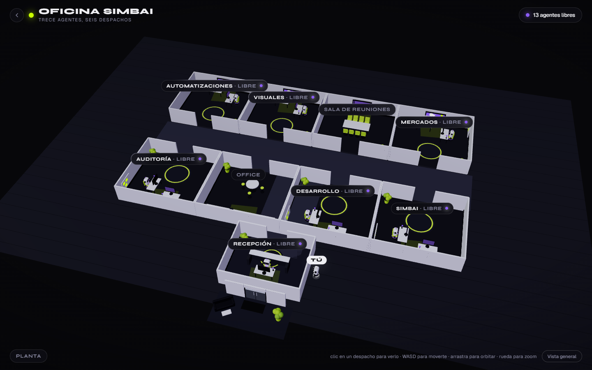

# Oficina SIMBAI: trece agentes de IA en una planta 3D

Una planta cartoon con seis despachos de dos puestos y una recepción. Cada agente es un robot flotante cuyo color dice si trabaja, está libre o se ha parado. Tú entras con tu robot blanco, te acercas a quien quieras y hablas con la asistenta de recepción o con los agentes reales.



## Los puestos

| Despacho | Puestos | De dónde salen sus datos |
|---|---|---|
| Recepción | asistenta | endpoint de estados |
| Mercados | explorador, analista | endpoint de estados |
| Desarrollo | constructor, revisor | endpoint de estados |
| Automatizaciones | diseñador de flujos, integrador | endpoint de estados |
| Visuales | director de arte, maquetador | endpoint de estados |
| Auditoría | auditor técnico, auditor de negocio | endpoint de estados |
| SIMBAI | captacion-crm, recepcion-abogados | `/api/agentes`, los agentes que existen de verdad |

## Cómo está distribuida la planta

Se entra por una puerta de cristal con su zaguán y su felpudo, a un vestíbulo con sofá de espera, frente al mostrador de recepción. De ahí arranca el pasillo, con suelo propio más claro, que recorre la planta entre las dos filas de salas.

En el centro de cada fila hay una zona común, por donde pasa todo el mundo: la sala de reuniones con su mesa larga y su pantalla, y el office con encimera, cafetera y mesa alta con taburetes. No tienen agentes: su rótulo solo lleva el nombre, sin estado.


Los despachos siguen el recorrido de un encargo, como en una oficina de verdad. Desde la entrada hacia el fondo:

| Distancia a la entrada | Norte | Sur |
|---|---|---|
| Junto a recepción | Mercados, que capta | SIMBAI, los agentes que atienden |
| Centro | Visuales | Desarrollo |
| Fondo | Automatizaciones | Auditoría |

Lo que trata con fuera queda cerca de la puerta, la producción en medio y el trabajo técnico y de control al fondo, donde hay menos paso. Las dos filas se leen en paralelo, así que lo que se pasa trabajo queda enfrentado. El orden vive en la constante `ORDEN` del script.

Los dos puestos de cada despacho van en L sobre la misma esquina, con una pizarra compartida: el trabajo pasa de uno a otro y la escena lo cuenta.

El despacho SIMBAI es distinto: sus dos puestos son los agentes reales de `agents/`. Su estado sale de cuándo conversaron por última vez, su tarjeta muestra conversaciones, turnos y coste acumulado, y desde ella se puede hablar con cualquiera de los dos. El endpoint de estados no los toca.

## Estados

El color se ve desde la vista general, sin acercarse, en el robot y en la baliza de su mesa.

| Estado | Color | Qué significa |
|---|---|---|
| trabajando | verde lima | el agente está ocupado; solo estos se animan |
| libre | violeta | disponible |
| parado | gris apagado | el motor local no responde |

## Ejecutar

Necesita Python 3.10 o superior. Nada más.

```bash
cd oficina-simbai
python server.py
```

En PowerShell:

```powershell
cd oficina-simbai
python server.py
```

Abre `http://localhost:8794`. Variables opcionales: `PUERTO` (8794) y `HOST` (`127.0.0.1`; pon `0.0.0.0` para verla desde el móvil en tu red).

## De dónde vienen los estados

La oficina sondea cada 5 segundos `http://localhost:8080/estado.json`. Para usar otro, o para apagar el sondeo dejándolo vacío:

```
http://localhost:8794/?estado=http://otra-maquina:9000/estado.json
http://localhost:8794/?estado=
```

El endpoint necesita la cabecera `Access-Control-Allow-Origin`, porque lo pide el navegador desde otro puerto.

El JSON tiene esta forma. Las claves de `despachos` son los nombres de puesto de la tabla de arriba, y `despacho` es uno de `mercados`, `desarrollo`, `automatizaciones`, `visuales`, `auditoria`, `recepcion`.

```json
{
  "despachos": {
    "explorador": {
      "despacho": "mercados",
      "situacion": "trabajando",
      "detalle": "busca oportunidades en hoteles de Málaga",
      "cuando": "2026-09-28T11:20:00"
    },
    "maquetador": {
      "despacho": "visuales",
      "situacion": "libre",
      "detalle": "",
      "cuando": "2026-09-28T11:18:00"
    }
  },
  "ultimo_cambio": "2026-09-28T11:20:00"
}
```

Un agente que no aparezca se muestra libre. Si el endpoint no responde, la planta sigue en pie con todos libres y un aviso discreto, nunca una pantalla de error. Sin `?estado=` se ven datos de ejemplo con tres agentes trabajando.

## Parámetros de la URL

| Parámetro | Por defecto | Qué hace |
|---|---|---|
| `estado` | `http://localhost:8080/estado.json` | URL del JSON de estados; vacío apaga el sondeo |
| `embed` | `0` | HUD compacto para iframe |
| `name` | `OFICINA SIMBAI` | nombre en la cabecera |
| `tagline` | `trece agentes, seis despachos` | subtítulo |
| `accent` | `%23c8ff00` | color de marca, también el de "trabajando" |
| `chat` | `1` (`0` si `embed=1`) | panel de conversación en recepción |
| `labels` | `1` | rótulos de los despachos |

## Controles

- Clic en un despacho: la cámara se acerca y sale una tarjeta con sus dos agentes, su estado y qué hacen.
- Clic en recepción o en SIMBAI: además, el chat. En SIMBAI se elige con cuál de los dos agentes hablar.
- Clic fuera o tecla Escape: vuelta a la vista general.
- Arrastrar para orbitar, rueda para zoom, WASD o flechas para moverte.

## Comprobar

```bash
python server.py --test
```

En el navegador, `?test` ejecuta los asserts de estados y colisión en la consola.

## Rendimiento

Trece robots comparten geometría, solo se animan los que trabajan y no hay luces puntuales por personaje. Si aun así la escena baja de 30 fotogramas por segundo, se apagan sombras y se baja la resolución sola.

## Origen

Es la oficina 3D de SIMBAI OS, el panel interno de [SIMBAI](https://github.com/kdl177), con el robot, la paleta y el mobiliario del prototipo "AI Office 3D" que Runable generó en `packages/web`. El chat de recepción usa el `/api/hablar` de SIMBAI OS, así que con este servidor mínimo avisa de que no está disponible.
